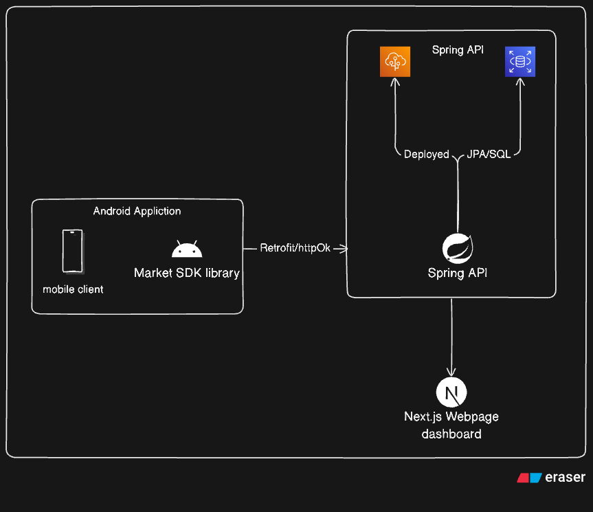

# MarketPlatform – Full Stack System Overview

This repository contains a complete full-stack system for managing online markets using Android, web, and backend components.

## 📁 Folder Structure

### `API/`
- **Type**: Spring Boot Backend
- **Description**: This is the RESTful API service responsible for handling business logic, database interactions, and exposing endpoints to the SDK and Dashboard.
- **Technologies**:
  - Java 17
  - Spring Boot
  - JPA & Hibernate
  - PostgreSQL (via RDS on AWS)
  - Deployed using Docker + AWS Elastic Beanstalk

---

### `Dashboard/`
- **Type**: Frontend Web App
- **Description**: A Next.js + TypeScript web dashboard for app developers. Allows developers to:
  - Register and log in
  - Create their first market
  - View posts and categories
  - Monitor statistics and trends via charts
- **Technologies**:
  - Next.js 14
  - TypeScript
  - Axios for API calls
  - Recharts for visual data

---

### `MyApplication/`
- **Type**: Android Demo App
- **Description**: Example Android application that uses the `MarketSDK` library. Demonstrates how to initialize the SDK and perform actions like:
  - Fetching markets
  - Posting data
  - Handling categories
- **Technologies**:
  - Android SDK
  - Java 17
  - Retrofit for networking

---

### `MarketSDK/` (submodule)
- **Type**: Android Library (SDK)
- **Description**: A standalone Android SDK that allows any app to integrate marketplace functionality.
- **Functionality**:
  - CRUD operations for Markets, Posts, Categories
  - Built-in validation
  - Simple callback-based architecture
- **Installation**: Available through JitPack

---

## System Diagram

